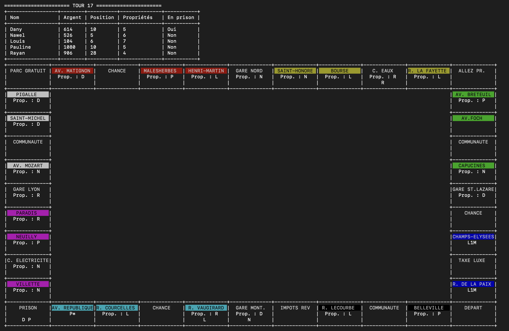

<div align="right">
  <a href="./README.md">English</a> |
  <a href="./README_fr.md">Français</a> |
  <a href="./README_es.md">Español</a>
</div>

# Monopoly en Console en C


Une simulation complète et fonctionnelle du jeu de société Monopoly, développée en C. Ce projet implémente l'ensemble des règles officielles, y compris la gestion immobilière (achat, construction, hypothèque), les enchères, les négociations entre joueurs et plusieurs modes de jeu, le tout dans un terminal de type Unix.



## Table des Matières

- [À Propos du Projet](#à-propos-du-projet)
- [Fonctionnalités Clés](#fonctionnalités-clés)
- [Architecture & Conception](#architecture--conception)
- [Stack Technique](#stack-technique)
- [Installation et Lancement](#installation-et-lancement)
- [Licence](#licence)
- [Contact](#contact)

## À Propos du Projet

Ce projet a été réalisé dans le cadre d'un cursus universitaire à l'Université Paris Cité. L'objectif principal était d'implémenter de A à Z un moteur de jeu complexe en langage C, sans dépendances externes, en se concentrant sur la robustesse des structures de données, la gestion d'état et l'interaction utilisateur dans un environnement console.

## Fonctionnalités Clés

-   🎲 **Moteur de Jeu Complet :** Gère les tours des joueurs, les lancers de dés, les déplacements, les règles de la prison et le tirage des cartes ("Chance" & "Caisse de Communauté").
-   🏛️ **Gestion Immobilière Avancée :** Acheter des propriétés, construire des maisons et hôtels (avec respect de la règle d'équilibre), percevoir les loyers et hypothéquer des biens pour lever des fonds.
-   🤝 **Interactions Riches entre Joueurs :** Inclut un système d'**enchères** automatique lorsqu'un joueur refuse d'acheter, et un module de **négociation** complet pour échanger propriétés, argent et cartes "Libéré de Prison".
-   🏆 **Trois Modes de Jeu Distincts :**
    1.  **Classique :** Le dernier joueur non ruiné remporte la partie.
    2.  **Tours Limités :** Le joueur le plus riche gagne à l'issue d'un nombre de tours défini.
    3.  **Objectif Monétaire :** Le premier joueur à atteindre un capital cible gagne.
-   🎨 **Interface ASCII Élaborée :** Un plateau de jeu complet, coloré et mis à jour dynamiquement, rendu en ASCII. Il affiche les groupes de propriétés, les bâtiments et la position des pions en temps réel.
-   💾 **Persistance des Parties :** Sauvegardez l'état complet d'une partie en cours dans un fichier et chargez-la plus tard pour reprendre le jeu.
-   📜 **Tableau des Meilleurs Scores :** Les 10 meilleurs scores sont enregistrés et affichés de manière persistante, encourageant la rejouabilité.

## Architecture & Conception

L'application est architecturée comme un **programme C monolithique** (l'ensemble du code source est contenu dans un unique fichier `monopoly.c`). L'état du jeu est géré via un ensemble de variables globales et de structures de données `struct` (`Joueur`, `CasePlateau`, `Carte`), une approche pragmatique qui simplifie le flux d'informations entre les fonctions dans ce contexte.

La persistance des données est assurée par un mécanisme de **sérialisation personnalisé en fichiers texte**. Les sauvegardes et les meilleurs scores sont écrits dans des fichiers `.txt` portables, permettant de reprendre facilement une session de jeu sur une autre machine compatible.

## Stack Technique

-   **Langage :** C (Standard C11)
-   **Compilateur :** GCC / Clang
-   **Environnement :** Terminal de type Unix (Linux, macOS)
-   **Dépendances :** Aucune (uniquement les bibliothèques C standard).

## Installation et Lancement

Pour obtenir une copie locale et la faire fonctionner, suivez ces étapes simples.

1.  **Clonez le repository :**
    ```sh
    git clone https://github.com/Alespfer/monopoly-pise-2025.git
    ```
2.  **Naviguez vers le dossier du projet :**
    ```sh
    cd monopoly-pise-2025
    ```
3.  **Compilez le programme :**
    Le projet n'a aucune dépendance externe et se compile avec une seule commande.
    ```sh
    cc -o monopoly monopoly.c
    ```
4.  **Lancez l'application :**
    ```sh
    ./monopoly
    ```
    Le menu principal apparaîtra, vous pourrez alors démarrer une nouvelle partie, en charger une, ou consulter les règles.

## Licence

Distribué sous la licence MIT. Voir `LICENSE` pour plus d'informations.

## Contact

Projet réalisé par **Alberto ESPERÓN**.

-   Alberto ESPERÓN - [Profil LinkedIn](https://www.linkedin.com/in/alberto-espfer) - [Profil GitHub](https://github.com/Alespfer)
